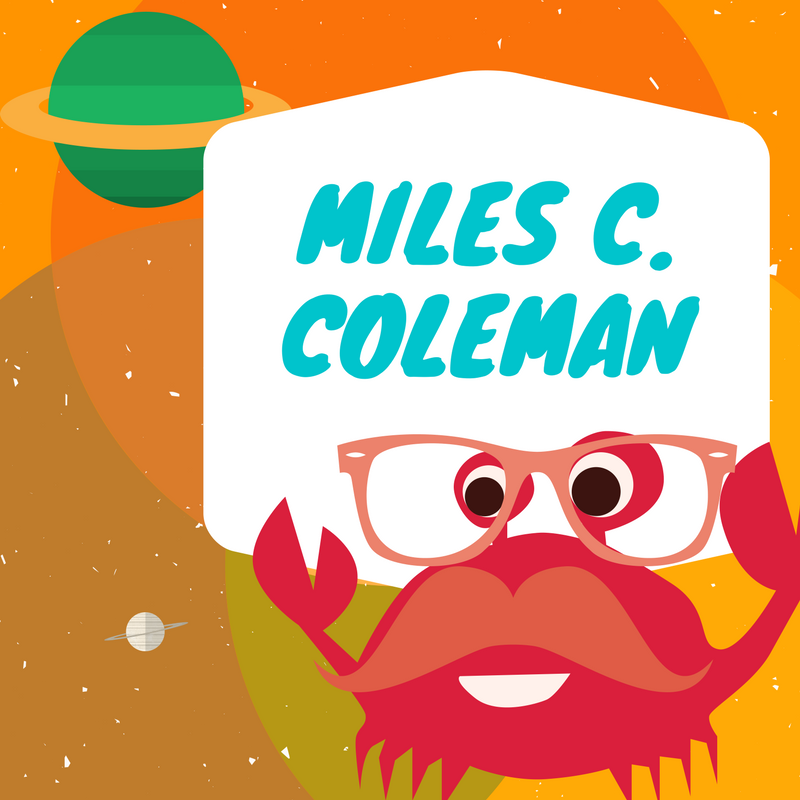

<!-- Global site tag (gtag.js) - Google Analytics -->

-[rhetoric, ethics, and public vaccine science](https://slides.com/milescoleman/deck/fullscreen)

-[rhetoric of science](https://slides.com/milescoleman/rhetoric-of-science-2/fullscreen)

-[feels_bot](http://milesccoleman.com/feels_botpage/) 

-[sonification of periodic table of elements](https://milesccoleman.com/sonificationexample/)

-[what does food sound like?](https://milesccoleman.com/whatdoesfoodsoundlike/)

-[magical bots](https://milesccoleman.com/magicalcompulsions/)

<iframe src="https://autocomm.gitbook.io/botcomm/" height="1000" width="1000"></iframe>
